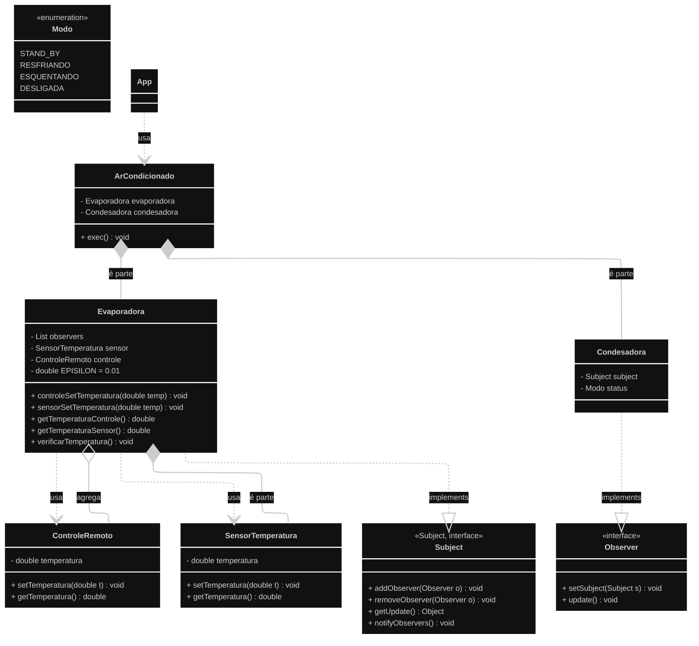

# Exercício 1 – Ar-Condicionado Residencial

Crie um conjunto de classes para um **ar-condicionado residencial**. Considere que o aparelho só precisa **acionar a condensadora** quando a **temperatura do ambiente** é diferente daquela **indicada pelo usuário (via controle remoto)**, caso contrário deve **entrar em stand-by**.  
Considere que o **sensor de temperatura do ambiente está instalado na evaporadora**. 

> ⚠️ Observação: Sugere-se a criação das classes conforme o **diagrama UML** abaixo (se preferir, você pode adotar outra composição de classes).  
*(que foi o meu caso, já que meu UML está levemente diferente).*

## Diagrama UML 

Condesadora *-- Modo: é parte
Evaporadora -- Condesadora: notifica
