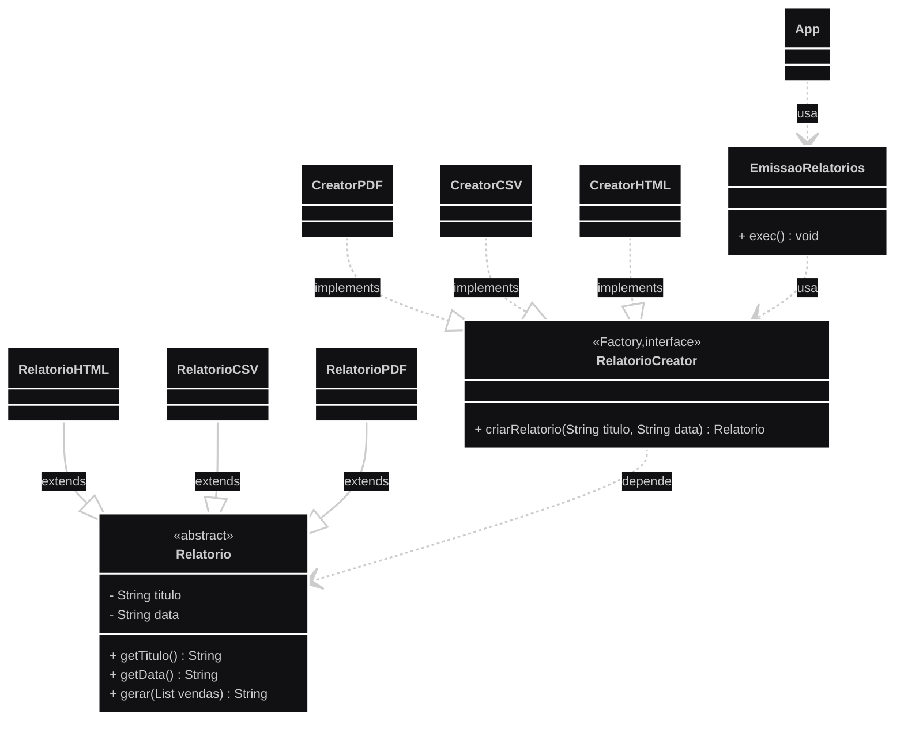

# Exercício 2 - Gerar Relatórios de Venda
Implemente um sistema em Java que gere relatórios de vendas em três formatos: HTML, PDF (simulado como String) e CSV (produtos). 
Use o padrão Factory Method para desacoplar o código cliente dos tipos concretos de relatório. Sugere-se a utilização das classes conforme o diagrama UML abaixo (opcional). Observe que neste diagrama RelatorioCreator é uma
interface e Relatorio uma classe abstrata, assim como os métodos criarRelatorio e gerar são abstratos:

> ⚠️ Observação: Sugere-se a criação das classes conforme o **diagrama UML** abaixo (se preferir, você pode adotar outra composição de classes).  
*(que foi o meu caso, já que meu UML está levemente diferente).*

## Diagrama UML

